# fm-comms

Zenoh transport for First Motive's inter-device links.

## What

Every First Motive device — the workstation, the recorder and processor rigs, a
desktop or phone on the tailnet — talks to the others over one comms fabric.
`fm-comms` holds that fabric's configuration and the scripts that deploy it: a
single `zenohd` router and a `zenoh-bridge-ros2dds` per host, so ROS 2 traffic
crosses Wi-Fi and the WAN without every host needing to see every other host's
DDS multicast.



DDS no longer crosses a network at all. Each host keeps a loopback-only DDS
graph, and its bridge republishes only the topics its profile allows. The router
runs on Rune, the always-on office Mac mini — on that machine's host under
launchd, and never inside its CI guest. It is not on the GPU workstation, because
that machine is wiped, rebooted, and loaded with sim and inference, and every
reboot would take the fleet's discovery point with it.

The router binds two sockets and no more: Rune's LAN address and its tailnet
address. In the office a rig connects over the switch it is already plugged into;
off-site, or on a Wi-Fi link that filters multicast, the same rig connects through
the tailnet. A machine that moves changes its endpoint, not its transport. A
wildcard bind is refused, because it would offer the fleet's whole topic graph to
every network the box touches — Rune's CI guest network included.

This repo carries **no ROS packages and no application code**, with one named
exception. It is otherwise configs, systemd units, a launchd job, a compose
overlay, and the install scripts that place them. It is vendored into the
[`fm-ros2`](https://github.com/first-motive/fm-ros2) workspace at `comms/` (and
carries a `COLCON_IGNORE` so colcon skips it), the same way
[`fm-docker`](https://github.com/first-motive/fm-docker) is.

The exception is `episodes/`, the episode queryable. It is Python, and it stays
here because what it implements is a transport surface rather than a behaviour:
it answers Zenoh queries on `fm/episodes/**`, and its whole reason to exist is
that MCAP bytes must NOT be streamed as topics across the fabric. Moving it to a
package repo would put half of one wire contract in each of two repos. Its logic
imports no Zenoh at all — `store.py`, `query.py`, and `machine.py` are pure, and
`service.py` is the only module that opens a session — which is why its test
suite needs neither a router nor a network.

## The Hardware Gate

The zenoh-only transport does not replace the FastDDS LAN profile because it
renders and passes CI. It replaces it when four real machines exchange topics and
episodes over it, and when the rules that keep a trajectory off an arm are shown
to hold. That checklist is [`docs/HARDWARE-GATE.md`](docs/HARDWARE-GATE.md):
every line has a command and a pass criterion, every line must be green, and the
completed list goes in the pull request.

## Install

Pick the role this host plays:

```bash
./install.sh --role router      # Rune: run zenohd under launchd
./install.sh --role bridge      # a rig or a Mac: run zenoh-bridge-ros2dds
./install.sh --role client      # a laptop: the CLI tools only
./install.sh --role endpoint    # a host with no DDS graph: the shared env file only
```

`--role endpoint` is the narrowest role: it places `/etc/fm-comms.env` and stops.
It is for a host that talks to the router without joining a DDS graph — the
Almond Axol, whose own stack owns the CAN bus and whose agent publishes joint
states onto Zenoh directly, so a bridge there would carry nothing. The router
endpoint still has to come from somewhere, and it comes from the one file the
whole fleet shares.

`--role bridge` dispatches by OS. On Linux it places a systemd unit, up at boot;
on macOS it places a user LaunchAgent, up while someone is logged in. The Mac
needs a bridge for the same reason a rig does — under this profile its DDS graph
is loopback-only, so without one its ROS tools see nothing the fleet publishes.

Inspect before running, or see what a run would do:

```bash
curl -fsSL https://raw.githubusercontent.com/first-motive/fm-comms/v0.2.0/install.sh -o install.sh
less install.sh && bash install.sh --role router --dry-run
```

Remove what the installer placed:

```bash
./install.sh uninstall --role router
```

## Usage

`run.sh` dispatches the verbs under `scripts/`:

```bash
./run.sh --help
```

### Where a value comes from

Nothing about a specific machine is typed into this repo. A host's own facts come
from its **machine identity card** — `/etc/fm/machine.json` on Linux,
`~/.config/fm/machine.json` on macOS, `$FM_MACHINE_FILE` anywhere — which
[`fm-setup`](https://github.com/first-motive/fm-setup) writes with
`fm machine init`. What the whole fleet shares stays in `/etc/fm-comms.env`, which
the installer places from `systemd/fm-comms.env.example` on first run and which is
never committed.

| Value | Comes from |
| --- | --- |
| rig namespace (`fm-rec-01` → `fm_rec_01`) | card `name` |
| recordings directory | card `workspace`, plus `/recordings` |
| whether this host runs Zenoh at all | card `transport` |
| where a `curl \| bash` install puts its checkout | card `workspace` |
| bridge profile | card `workload`, refined by card `robot` |
| router endpoint, router port, ROS domain | `/etc/fm-comms.env` — fleet-wide |
| the router's two bind addresses | the host itself, at render time |

The profile is the card's `workload`, which is the field that answers what `role`
cannot — a recorder rig and a processor rig are both jetsons. It picks the topic
set:

```
recorder     head + wrist cameras, hand tracking, capture session, LiDAR
processor    the dataset engine's run state and commands
robot        joint states and TF out, Servo jog commands in
robot-anvil  an Anvil workcell: state and cameras out, nothing in
workstation  the GPU tower: robot and processor at once, since it runs both
cockpit      the Mac: the fleet's published set in, teleop commands out
```

`robot-anvil` is the one profile a card does not name directly. A host whose
workload is `robot` and whose `robot` field names an anvil kind takes it instead
of `robot`, because an Anvil is driven through the robot agent's queryables and
never by publishing to it. It is the robot profile with the inbound half removed:
joint states, hardware state, recording status, controls owner, end effector
poses, and compressed camera frames go out, and no topic comes back.

`workstation` is the union of `robot` and `processor`, and exists because the
tower is genuinely both machines: the sim publishes the joint states the cockpit
renders while the dataset engine runs beside it. Under `processor` alone its
bridge held a session and carried no state (fm-comms#20).

`cockpit` is the mirror of the others, and reads backwards on purpose. A rig
publishes what it produces and accepts a few commands; the Mac subscribes to what
the fleet publishes and publishes only teleop. It also carries no namespace: the
rigs already prefix their keys, and the Mac's job is to see them as
`/fm_rec_01/...` exactly as they were sent.

Set it with `fm machine init --workload cockpit`. `FM_BRIDGE_PROFILE` in the env
file still overrides it for a bench run.

### Check a render before installing it

The configs in `zenoh/` carry `${FM_...}` placeholders. `./run.sh render` resolves
them exactly as an install would and prints the result instead of writing it:

```bash
./run.sh render show              # this host's facts, and where each came from
./run.sh render bridge            # what /etc/fm-comms/bridge.json5 would be
./run.sh render router
./run.sh render launchd           # the router's LaunchDaemon plist
./run.sh render launchagent       # the Mac bridge's LaunchAgent plist
./run.sh render episodes
```

Point `FM_MACHINE_FILE` and `FM_COMMS_ENV_FILE` at a pair of files to rehearse
another host's render from a laptop. Both installers print the same text under
`--dry-run`.

Hosts that run the stack in Docker use the compose overlay instead of the
systemd units — same configs, same pinned version:

```bash
./run.sh compose up -d zenoh-bridge
```

## Episodes

A processor rig also serves the recorder's episodes over Zenoh, so the desktop or
a remote contractor can pull one episode instead of waiting for a whole
recordings directory to sync:

```
fm/episodes/index          every indexed episode, newest-first     JSON
fm/episodes/<id>/meta      one episode's index record              JSON
fm/episodes/<id>/sidecar   that episode's .episode.json            JSON
fm/episodes/<id>/files     the bag directory's file names          JSON
fm/episodes/<id>/file/<n>  one of those files, verbatim            octet-stream
fm/episodes/<id>/mcap      that episode's MCAP bytes               octet-stream
```

A bag is a directory, not a file: rosbag2 writes `<name>_0.mcap` next to a
`metadata.yaml` that names it, and the data engine drops a directory carrying one
without the other. `files` and `file/<name>` are what let a puller rebuild the bag
under the recorder's own names.

The sidecar is served because it is what makes a fetched episode processable: the
index record is derived and carries only what a listing view needs, while the
`.episode.json` beside each bag is what the data engine reads.

```bash
./run.sh episodes install     # enable the service
./run.sh episodes run         # or serve in the foreground
```

The pull half runs on the machine that wants the episodes:

```bash
cd episodes && uv sync
uv run episodes-fetch                 # fetch every episode this host is missing
uv run episodes-fetch --limit 1       # or just the newest one
```

It compares the two indexes, pulls what is absent, and writes each episode's
sidecar and MCAP before appending its index line — so a supervisor reading the
index never sees a row whose bag is half-written. `fm dataset process` in fm-ros2
calls this before it processes, which is how a recorder's takes reach a processor
on another network without a relay through anyone's laptop.

It serves `<workspace>/recordings` from the identity card, so a rig says where its
bags are once rather than in a unit file, an env file, and a developer's shell.

Reads only — the rsync pipeline stays the source of truth for moving recordings
between hosts. Index and fetch, no streaming replay: a query is one request and
one reply, so an MCAP over `FM_EPISODES_MAX_BYTES` is refused rather than stalling
the router.

## Remote Access

Someone outside the office needs a tailnet account and one ACL grant — TCP 7447 on
the router, nothing else. [`docs/REMOTE.md`](docs/REMOTE.md) is the runbook: invite,
grant, endpoint, smoke commands, and what the grant deliberately does not allow.

## Development

Lint the scripts — the same check CI runs:

```bash
shellcheck $(find . -name '*.sh' -not -path './.git/*')
```

Test the episode queryable:

```bash
uv run --project episodes pytest -q
```

See `CONTRIBUTING.md` for the branch, commit, and PR workflow.

## License

Apache-2.0 — see `LICENSE` and `NOTICE`.
